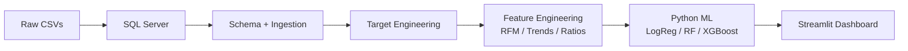

# 🛡️ CRIS — Customer Risk Intelligence System

**Predictive Analytics & Risk Classification Engine**

CRIS is a machine learning solution that predicts customer churn risk using a **SQL-First** architecture. It pushes heavy feature engineering into SQL Server, trains ML models in Python, and serves predictions through an interactive Streamlit dashboard.

---

## 🏗️ Architecture

```
CSV Data → SQL Server (Docker) → SQL Feature Engineering → Python ML → Streamlit Dashboard
```



### Time-Aware Design
- **Observation Window**: Jan–Jun 2024 (feature computation)
- **Prediction Window**: Jul–Aug 2024 (churn labels)
- Zero data leakage — enforced via TDDQ tests

---

## 📁 Project Structure

```
CRIS/
├── docker-compose.yml          # SQL Server container
├── requirements.txt            # Python dependencies
├── data/raw/                   # Synthetic CSV data
│   ├── customers.csv           # 200 customers
│   ├── orders.csv              # ~1000 orders
│   └── order_items.csv         # ~3000 items
├── sql/
│   ├── schema_creation.sql     # Table definitions (PK/FK)
│   ├── target_engineering.sql  # Churn label generation
│   ├── feature_eng.sql         # RFM + trend features (SQL view)
│   └── tests/                  # TDDQ assertion scripts
│       ├── test_schema.sql
│       ├── test_target_logic.sql
│       └── test_leakage.sql
├── notebooks/
│   ├── 01_eda.ipynb            # Exploratory analysis
│   └── 02_modeling.ipynb       # Training & evaluation
├── src/
│   ├── db_connector.py         # SQLAlchemy connection
│   ├── data_ingestion.py       # CSV → SQL pipeline
│   ├── preprocessing.py        # Feature cleaning & splitting
│   ├── inference.py            # Prediction engine
│   └── run_tddq.py            # Test runner
├── app/
│   └── main.py                 # Streamlit dashboard
├── models/                     # Serialized .pkl files
└── README.md
```

---

## 🚀 Quick Start

### 1. Prerequisites
- Docker Desktop
- Python 3.9+
- ODBC Driver 17 for SQL Server

### 2. Start SQL Server
```bash
docker compose up -d
```
> **Note**: SQL Server is mapped to port **1434** to avoid conflicts with local instances.
> SA Password: `MyStr0ng!Passw0rd`

### 3. Install Dependencies
```bash
pip install -r requirements.txt
```

### 4. Ingest Data & Build Features
```bash
python src/data_ingestion.py
```

### 5. Run Data Quality Tests
```bash
python src/run_tddq.py
```

### 6. Train Models
Open and run `notebooks/02_modeling.ipynb` (or use `jupyter notebook`).

### 7. Launch Dashboard
```bash
streamlit run app/main.py
```

---

## 📊 Features Engineered (SQL)

| Feature | Type | Description |
|---------|------|-------------|
| `recency_days` | RFM | Days since last order |
| `frequency` | RFM | Total order count |
| `monetary` | RFM | Total spend |
| `avg_order_value_lifetime` | Trend | Avg order value (full window) |
| `avg_order_value_last_3m` | Trend | Avg order value (last 3 months) |
| `trend_ratio` | Trend | Recent vs lifetime spend ratio |
| `cancel_rate` | Ratio | Fraction of cancelled orders |
| `return_rate` | Ratio | Fraction of returned orders |
| `unique_categories` | Diversity | Product category count |
| `unique_products` | Diversity | Distinct product count |
| `avg_days_between_orders` | Regularity | Mean inter-order gap |

---

## 🧪 TDDQ — Test-Driven Data Quality

| Test Suite | What It Validates |
|------------|-------------------|
| `test_schema.sql` | PK uniqueness, NOT NULL, FK integrity |
| `test_target_logic.sql` | Churn labels match temporal logic |
| `test_leakage.sql` | Features use only observation-window data |

---

## 🤖 Models

| Model | Purpose |
|-------|---------|
| Logistic Regression | Baseline (interpretable) |
| Random Forest | Non-linear patterns |
| XGBoost | Gradient boosting (if installed) |

**Primary metric**: PR-AUC (handles class imbalance better than accuracy).

---

## 🎓 Key Technical Decisions

1. **SQL-First Feature Engineering** — Scales to BigQuery/Snowflake; features live in the DB, not Python scripts
2. **Time-Based Splitting** — No random `train_test_split` on transactional data
3. **TDDQ over Unit Tests** — Validates data quality at the source before modeling
4. **class_weight='balanced'** — Penalizes missing the minority (churn) class

---

## 📄 License

This project is for educational and portfolio purposes.
