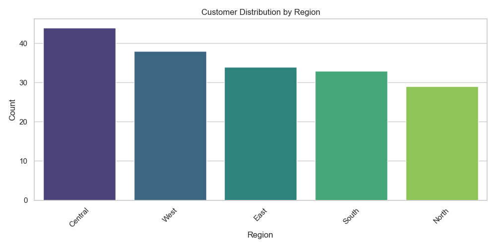
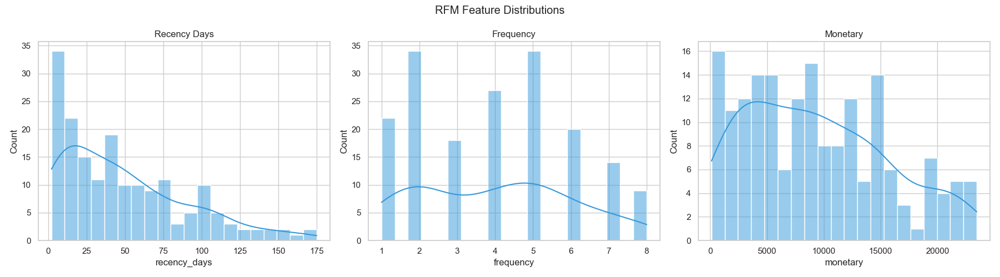
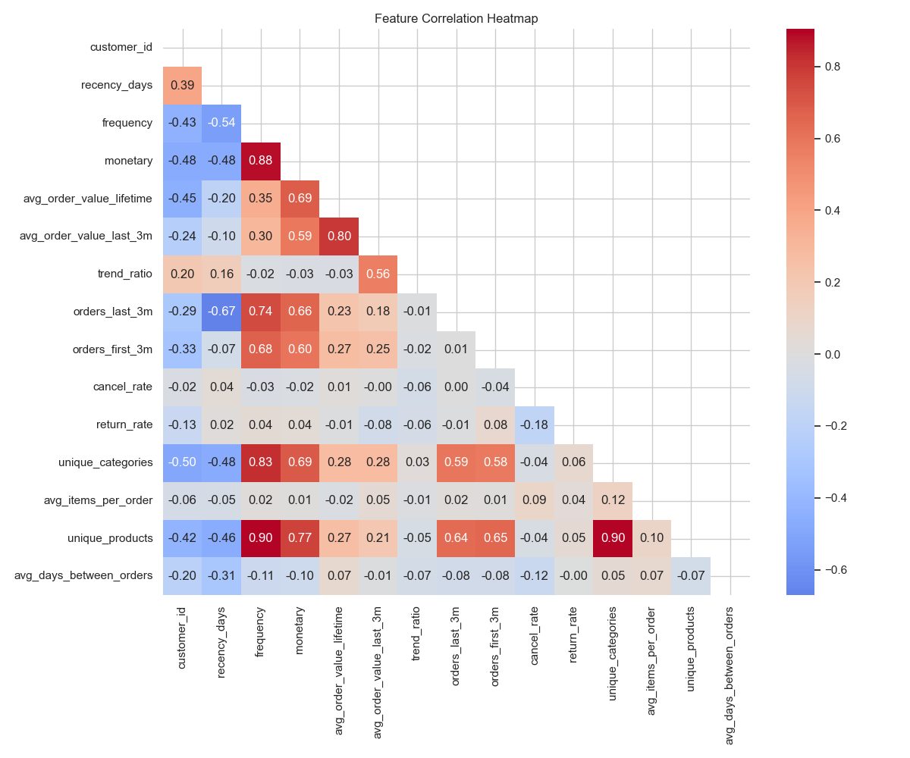

# Exploratory Data Analysis Report (Full SQL)

> **Note**: This report reflects the full dataset exported from SQL Server.

## 1. Data Overview

- **Total Customers**: 200
- **Total Orders**: 989
- **Total Items**: 3005
- **Features Available**: 14

## 2. Demographics

### Regional Distribution

## 3. Behavioral Analysis (RFM)

Distribution of Recency, Frequency, and Monetary values across the customer base:

## 4. Feature Correlations

Relationships between behavioral features:

